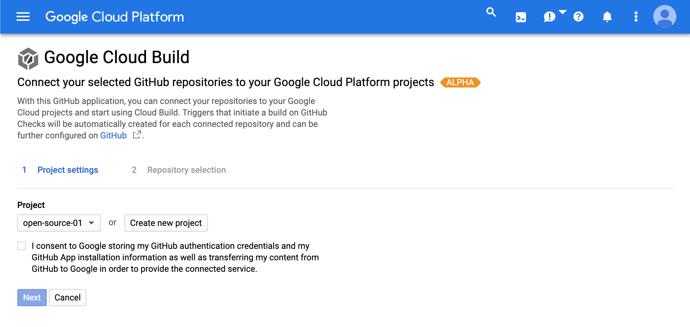
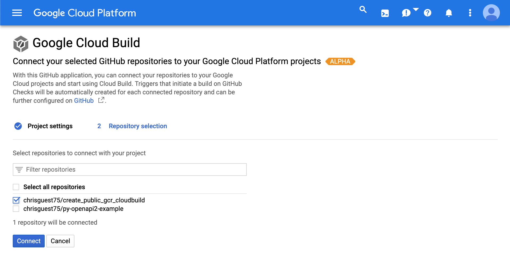

# README.md
The code and config are all based on walkthroughs and blogs I've read.  

An example of how to setup and configure CloudBuild for a simple container.
The idea is to fork it, change the relevant files and use the examples.  

With just the Cloud Build integration it will take a private repo and build from a dockerfile in the repo.  The way it seems to do this is by using a shallow copy uploaded to storage as a zip file. 

If you want to have a simple incremental build number without too many external dependencies.  You can sync the repo manually and securely use the git branch depth as the build number.

LINKS

# Running NodeApp Locally
You can run and debug the hellonode app in VSCode or through docker-compose.

```
docker-compose up --build
docker-compose down
```

# Testing 
```
curl http://localhost:5000
```

# Configuring Cloud Build
* You will need a GCP account and the Google SDK installed. 
    * Create a project
        * Enable Google Container Registry (choose if you want your registry public or not)
        * Enable Cloud Build
        * Enable KMS and create a keyring and key
* Add the Github Cloud Build integration 
* Fork or copy the project
* Change the cloudbuild.yaml
    * _GITHUB_USERNAME: "chrisguest75" 
* Generate an SSL key and upload to Github
    * Use ./create_key.sh
    * After using the script upload the ./cloudbuild_ssh.key.pub to github as an ssl key.
* Commit to the repo 
* Watch the GCP console and monitor the build. 


# Github Integration 

After installing the Github integration you can configure it. During configuation it will swith to GCP


The repository can be selected.
